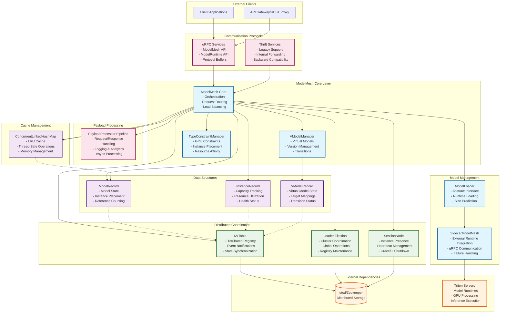

# ModelMesh Top-Level Architecture

## Internal Component Architecture

## Component Descriptions

### Core Components
- **ModelMesh Core**: Central orchestrator managing model lifecycle, request routing, and load balancing
- **VModelManager**: Manages virtual models for versioning, A/B testing, and seamless transitions
- **TypeConstraintManager**: Handles GPU affinity and resource constraints for optimal model placement

### Model Management
- **ModelLoader**: Abstract interface for loading different model types with size prediction
- **SidecarModelMesh**: Implements sidecar pattern for external model runtime integration

### Data Structures
- **ModelRecord**: Tracks model state, instance placement, and reference counting
- **InstanceRecord**: Monitors cluster capacity, utilization, and health status
- **VModelRecord**: Manages virtual model state and target mappings
- **ConcurrentLinkedHashMap**: Thread-safe LRU cache for efficient model memory management

### Distributed Coordination
- **KVTable**: Distributed registry with event notifications and state synchronization
- **Leader Election**: Ensures single coordinator for cluster-wide operations
- **SessionNode**: Manages instance presence and graceful lifecycle management

### Communication
- **gRPC Services**: Modern API for external model management and internal runtime communication
- **Thrift Services**: Legacy protocol support for backward compatibility
- **PayloadProcessor**: Pipeline for request/response processing and analytics

### External Dependencies
- **etcd/Zookeeper**: Distributed storage backend for cluster state and coordination
- **Triton Servers**: External model runtimes providing GPU-accelerated inference

## Key Architectural Patterns

1. **Sidecar Pattern**: ModelMesh runs alongside model runtimes for seamless integration
2. **Distributed Cache**: Intelligent LRU caching across cluster instances
3. **Leader Election**: Centralized coordination for global operations
4. **Observer Pattern**: Event-driven state synchronization across components
5. **Strategy Pattern**: Pluggable model loaders and payload processors