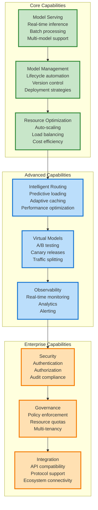
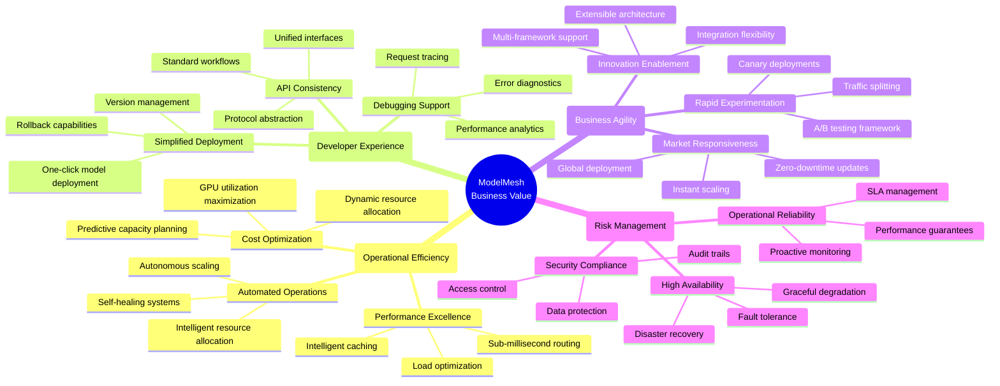

# ModelMesh Functional Architecture

## System Functions and Capabilities

This diagram shows the functional architecture of ModelMesh, organized by business capabilities and functional domains rather than technical components.

```mermaid
graph TB
    subgraph "Model Lifecycle Management Functions"
        MLM_REG[Model Registration<br/>- Artifact Discovery<br/>- Metadata Validation<br/>- Version Management]
        MLM_DEP[Model Deployment<br/>- Resource Allocation<br/>- Constraint Validation<br/>- Health Verification]
        MLM_UPD[Model Updates<br/>- Version Transitions<br/>- Rolling Deployments<br/>- Rollback Capability]
        MLM_RET[Model Retirement<br/>- Graceful Unloading<br/>- Cleanup Operations<br/>- Archive Management]
    end

    subgraph "Request Processing Functions"
        RP_ROUTE[Request Routing<br/>- Model Resolution<br/>- Instance Selection<br/>- Load Distribution]
        RP_PROC[Request Processing<br/>- Protocol Translation<br/>- Data Validation<br/>- Format Conversion]
        RP_EXEC[Execution Orchestration<br/>- Runtime Coordination<br/>- Parallel Processing<br/>- Result Aggregation]
        RP_RESP[Response Handling<br/>- Result Formatting<br/>- Error Translation<br/>- Client Delivery]
    end

    subgraph "Resource Management Functions"
        RM_ALLOC[Resource Allocation<br/>- GPU Assignment<br/>- Memory Management<br/>- CPU Scheduling]
        RM_OPT[Resource Optimization<br/>- Utilization Monitoring<br/>- Capacity Planning<br/>- Cost Management]
        RM_SCALE[Auto Scaling<br/>- Demand Prediction<br/>- Instance Provisioning<br/>- Load Balancing]
        RM_CONST[Constraint Management<br/>- Placement Rules<br/>- Affinity Policies<br/>- Resource Limits]
    end

    subgraph "Cache Management Functions"
        CM_STRAT[Caching Strategy<br/>- LRU Policies<br/>- Preloading Rules<br/>- Eviction Logic]
        CM_OPT[Cache Optimization<br/>- Hit Rate Analysis<br/>- Memory Efficiency<br/>- Access Patterns]
        CM_DIST[Distribution Logic<br/>- Multi-Instance Coordination<br/>- Consistency Management<br/>- Replication Strategy]
        CM_WARM[Cache Warming<br/>- Predictive Loading<br/>- Usage-Based Preloading<br/>- Scheduled Refresh]
    end

    subgraph "Virtual Model Functions"
        VM_ABST[Model Abstraction<br/>- Virtual Naming<br/>- Logical Grouping<br/>- Interface Standardization]
        VM_VER[Version Management<br/>- A/B Testing<br/>- Canary Deployments<br/>- Traffic Splitting]
        VM_TRANS[Transition Management<br/>- Zero-Downtime Updates<br/>- State Synchronization<br/>- Fallback Handling]
        VM_GOV[Governance<br/>- Access Control<br/>- Ownership Tracking<br/>- Audit Trails]
    end

    subgraph "Cluster Coordination Functions"
        CC_DISC[Service Discovery<br/>- Instance Registration<br/>- Health Monitoring<br/>- Topology Management]
        CC_CONS[Consensus Management<br/>- Leader Election<br/>- Distributed Locking<br/>- State Synchronization]
        CC_FAIL[Failure Handling<br/>- Fault Detection<br/>- Recovery Procedures<br/>- Graceful Degradation]
        CC_COMM[Communication<br/>- Inter-Instance Messaging<br/>- Event Broadcasting<br/>- State Propagation]
    end

    subgraph "Data & State Functions"
        DS_REG[Registry Management<br/>- Model Catalog<br/>- Instance Directory<br/>- Configuration Store]
        DS_PERS[Data Persistence<br/>- State Storage<br/>- Backup & Recovery<br/>- Data Consistency]
        DS_SYNC[Synchronization<br/>- Distributed Updates<br/>- Event Ordering<br/>- Conflict Resolution]
        DS_ARCH[Data Architecture<br/>- Schema Management<br/>- Migration Support<br/>- Versioning]
    end

    subgraph "Observability Functions"
        OBS_MON[Monitoring<br/>- Performance Metrics<br/>- Health Indicators<br/>- SLA Tracking]
        OBS_LOG[Logging<br/>- Request Tracing<br/>- Error Logging<br/>- Audit Logging]
        OBS_ALERT[Alerting<br/>- Anomaly Detection<br/>- Threshold Monitoring<br/>- Incident Response]
        OBS_ANAL[Analytics<br/>- Usage Patterns<br/>- Performance Analysis<br/>- Capacity Trends]
    end

    subgraph "Security Functions"
        SEC_AUTH[Authentication<br/>- Identity Verification<br/>- Token Management<br/>- Session Handling]
        SEC_AUTHZ[Authorization<br/>- Permission Management<br/>- Role-Based Access<br/>- Resource Policies]
        SEC_COMM[Secure Communication<br/>- TLS Encryption<br/>- Certificate Management<br/>- Network Security]
        SEC_AUD[Security Auditing<br/>- Access Logging<br/>- Compliance Tracking<br/>- Security Events]
    end

    %% Cross-functional relationships
    MLM_REG --> DS_REG
    MLM_DEP --> RM_ALLOC
    MLM_UPD --> VM_TRANS
    
    RP_ROUTE --> CM_STRAT
    RP_EXEC --> RM_ALLOC
    RP_PROC --> OBS_LOG
    
    RM_SCALE --> CC_CONS
    RM_OPT --> OBS_ANAL
    
    CM_DIST --> CC_COMM
    CM_WARM --> OBS_ANAL
    
    VM_VER --> DS_SYNC
    VM_GOV --> SEC_AUTHZ
    
    CC_FAIL --> OBS_ALERT
    CC_DISC --> DS_REG
    
    DS_PERS --> SEC_AUD
    
    %% Styling
    classDef lifecycle fill:#e8f5e8,stroke:#2e7d32,stroke-width:2px
    classDef processing fill:#e3f2fd,stroke:#1565c0,stroke-width:2px
    classDef resource fill:#fff3e0,stroke:#ef6c00,stroke-width:2px
    classDef cache fill:#f3e5f5,stroke:#7b1fa2,stroke-width:2px
    classDef virtual fill:#e0f2f1,stroke:#00695c,stroke-width:2px
    classDef coordination fill:#fce4ec,stroke:#c2185b,stroke-width:2px
    classDef data fill:#f1f8e9,stroke:#558b2f,stroke-width:2px
    classDef observability fill:#fff8e1,stroke:#f57f17,stroke-width:2px
    classDef security fill:#ffebee,stroke:#d32f2f,stroke-width:2px

    class MLM_REG,MLM_DEP,MLM_UPD,MLM_RET lifecycle
    class RP_ROUTE,RP_PROC,RP_EXEC,RP_RESP processing
    class RM_ALLOC,RM_OPT,RM_SCALE,RM_CONST resource
    class CM_STRAT,CM_OPT,CM_DIST,CM_WARM cache
    class VM_ABST,VM_VER,VM_TRANS,VM_GOV virtual
    class CC_DISC,CC_CONS,CC_FAIL,CC_COMM coordination
    class DS_REG,DS_PERS,DS_SYNC,DS_ARCH data
    class OBS_MON,OBS_LOG,OBS_ALERT,OBS_ANAL observability
    class SEC_AUTH,SEC_AUTHZ,SEC_COMM,SEC_AUD security
```

## Functional Interaction Patterns

```mermaid
graph LR
    subgraph "Model Onboarding Process"
        A1[Model Registration] --> A2[Validation & Metadata]
        A2 --> A3[Resource Assessment]
        A3 --> A4[Deployment Planning]
        A4 --> A5[Health Verification]
        A5 --> A6[Service Registration]
    end

    subgraph "Inference Execution Process"
        B1[Request Reception] --> B2[Model Resolution]
        B2 --> B3[Resource Allocation]
        B3 --> B4[Cache Management]
        B4 --> B5[Execution Coordination]
        B5 --> B6[Response Delivery]
    end

    subgraph "Model Evolution Process"
        C1[Version Detection] --> C2[Transition Planning]
        C2 --> C3[Traffic Management]
        C3 --> C4[Health Monitoring]
        C4 --> C5[Rollback Decision]
        C5 --> C6[State Synchronization]
    end

    subgraph "Resource Optimization Process"
        D1[Usage Monitoring] --> D2[Pattern Analysis]
        D2 --> D3[Optimization Planning]
        D3 --> D4[Resource Reallocation]
        D4 --> D5[Performance Validation]
        D5 --> D6[Cost Assessment]
    end
```

## Capability Matrix

## Business Value Functions

## Functional Domain Descriptions

### 🔄 Model Lifecycle Management
**Purpose**: End-to-end model lifecycle automation
- **Registration**: Discovery and cataloging of model artifacts
- **Deployment**: Automated deployment with validation
- **Updates**: Version management and transition handling
- **Retirement**: Graceful removal and cleanup

### ⚡ Request Processing
**Purpose**: High-performance request handling and routing
- **Routing**: Intelligent request distribution
- **Processing**: Protocol translation and validation
- **Execution**: Coordinated inference execution
- **Response**: Result formatting and delivery

### 🎯 Resource Management
**Purpose**: Optimal resource utilization and allocation
- **Allocation**: Dynamic resource assignment
- **Optimization**: Performance and cost optimization
- **Scaling**: Automatic capacity management
- **Constraints**: Policy-based placement control

### 🚀 Cache Management
**Purpose**: Intelligent model caching and memory optimization
- **Strategy**: LRU-based caching policies
- **Optimization**: Cache performance tuning
- **Distribution**: Multi-instance coordination
- **Warming**: Predictive model loading

### 🔮 Virtual Model Functions
**Purpose**: Model abstraction and advanced deployment patterns
- **Abstraction**: Logical model grouping
- **Versioning**: A/B testing and canary deployments
- **Transitions**: Zero-downtime model updates
- **Governance**: Access control and ownership

### 🌐 Cluster Coordination
**Purpose**: Distributed system coordination and consensus
- **Discovery**: Service registration and health monitoring
- **Consensus**: Leader election and distributed decisions
- **Failure Handling**: Fault detection and recovery
- **Communication**: Inter-node messaging and events

### 💾 Data & State Functions
**Purpose**: Persistent state management and consistency
- **Registry**: Centralized metadata management
- **Persistence**: Durable state storage
- **Synchronization**: Distributed state consistency
- **Architecture**: Schema and migration management

### 📊 Observability Functions
**Purpose**: System visibility and performance insights
- **Monitoring**: Real-time metrics collection
- **Logging**: Comprehensive audit trails
- **Alerting**: Proactive issue detection
- **Analytics**: Performance and usage analysis

### 🔒 Security Functions
**Purpose**: Comprehensive security and compliance
- **Authentication**: Identity verification
- **Authorization**: Access control and permissions
- **Communication**: Secure data transmission
- **Auditing**: Security event tracking

## Key Functional Principles

1. **Function Composition**: Complex capabilities built from simpler functions
2. **Cross-Cutting Concerns**: Security, observability, and reliability span all domains
3. **Event-Driven Coordination**: Functions coordinate through events and state changes
4. **Capability Layering**: Advanced capabilities build on core functions
5. **Business Value Alignment**: Each function contributes to measurable business outcomes