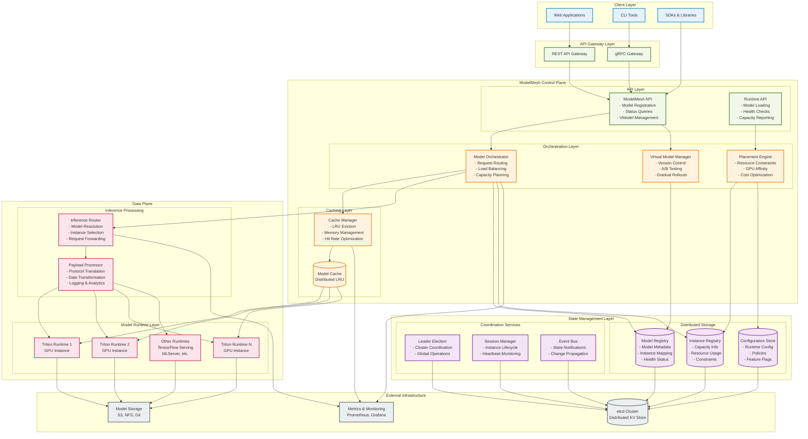
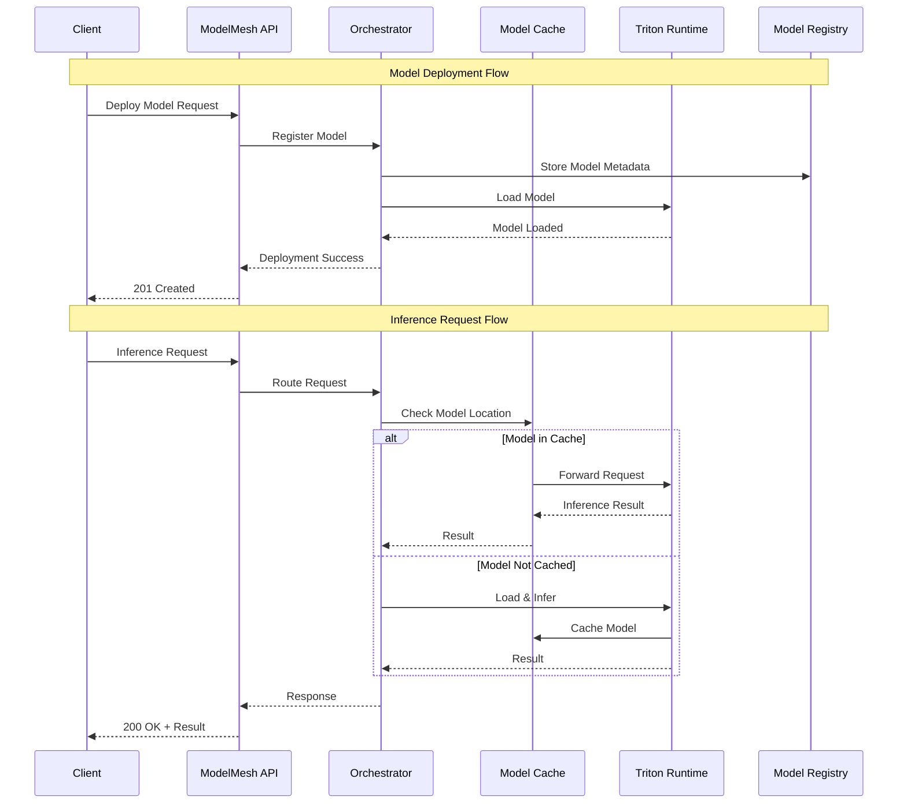
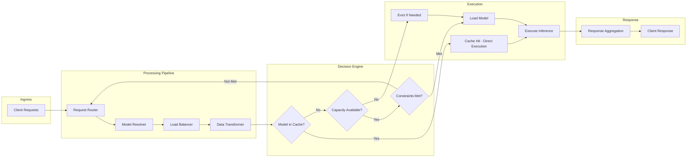

# ModelMesh Logical Architecture

## System Overview

This diagram shows the logical architecture of ModelMesh, illustrating the conceptual layers, data flow, and key interactions between different parts of the system.

## Request Flow Patterns

## Data Flow Architecture

## Logical Layer Descriptions

### Client Layer
- **Multiple Interfaces**: Web apps, CLI tools, SDKs for different programming languages
- **Protocol Abstraction**: Clients use familiar interfaces (REST, native gRPC)

### API Gateway Layer  
- **Protocol Translation**: REST to gRPC conversion for legacy clients
- **Request Validation**: Input validation and authentication
- **Rate Limiting**: Traffic control and quotas

### Control Plane
- **Orchestration**: Central brain coordinating all model operations
- **Virtual Models**: Abstraction layer for model versioning and transitions
- **Placement Logic**: Intelligent model placement based on constraints
- **Caching Strategy**: LRU cache management across cluster

### Data Plane
- **Runtime Abstraction**: Support for multiple model serving frameworks
- **Request Processing**: Protocol translation and payload handling
- **Performance Optimization**: Direct routing to loaded models

### State Management
- **Distributed Registries**: Centralized state storage for models and instances
- **Coordination**: Leader election and distributed consensus
- **Event Propagation**: Real-time state change notifications

### External Infrastructure
- **Model Storage**: Persistent storage for model artifacts
- **Configuration**: Distributed configuration management via etcd
- **Observability**: Metrics collection and monitoring integration

## Key Logical Principles

1. **Separation of Concerns**: Clear boundaries between control plane and data plane
2. **Event-Driven Architecture**: State changes propagate through event notifications
3. **Distributed Caching**: Intelligent model placement and caching decisions
4. **Pluggable Runtimes**: Support for multiple model serving frameworks
5. **Horizontal Scalability**: Stateless components with shared distributed state
6. **Fault Tolerance**: Leader election and graceful degradation mechanisms