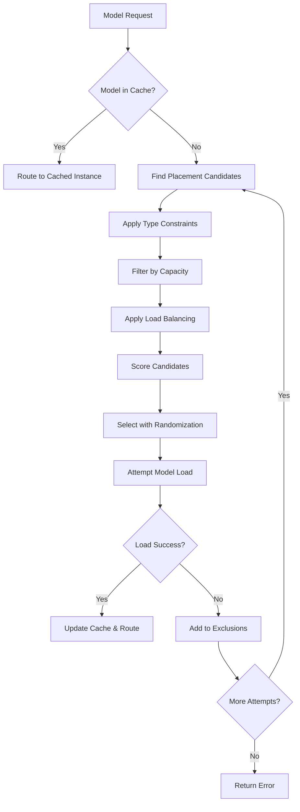

# ModelMesh Model Placement Strategy Analysis

Based on comprehensive analysis of the ModelMesh codebase, here's the complete model placement strategy used by ModelMesh.

## 🎯 Core Placement Philosophy

ModelMesh operates as a **distributed LRU cache** with intelligent placement decisions based on multiple optimization factors. The strategy balances **performance, capacity utilization, constraints, and fault tolerance**.

## 🏆 Primary Placement Algorithm: PLACEMENT_ORDER

ModelMesh uses a sophisticated **multi-criteria ranking system** to order instances for placement:

```java
// Placement priority (from ModelMesh.java)
PLACEMENT_ORDER = Comparator
    .comparing(Instance::isShuttingDown)           // 1. Avoid shutting down instances
    .thenComparing(Instance::isSaturatedNewVersion) // 2. Avoid saturated new versions
    .thenComparing(Instance::isFull)               // 3. Prefer non-full instances
    .thenComparing(Instance::getRemainingCapacity, reverseOrder()) // 4. More free space
    .thenComparing(Instance::getModelCount)        // 5. Fewer models (load distribution)
    .thenComparing(Instance::getLruTime, reverseOrder()) // 6. More recent activity
    .thenComparing(Instance::getId);               // 7. Stable ordering
```

## 🎲 Selection Strategy: Tolerance-Based Randomization

Instead of always picking the "best" instance, ModelMesh uses **smart randomization**:

1. **Tolerance Calculation**: Identifies instances "close enough" to the optimal choice
2. **Random Selection**: Randomly picks from qualified candidates
3. **Hotspot Prevention**: Avoids overwhelming single instances

## 🏷️ Type Constraints Integration

### Constraint-Based Filtering
```java
// TypeConstraintManager filtering
candidateInstances = typeConstraintManager.getCandidateInstances(modelType);
preferredInstances = typeConstraintManager.getPreferredInstances(modelType);
```

### Constraint Types:
- **Required Labels**: Hard constraints (e.g., `gpu`, `high-memory`)
- **Preferred Labels**: Soft preferences influencing scoring
- **Prohibited Types**: Models that cannot coexist on same instance

### Heterogeneous Cluster Support:
- **Instance Sets**: Groups instances with similar constraints
- **Subset Statistics**: Tracks capacity per constraint group
- **Dynamic Constraints**: Support for runtime constraint updates

## 📊 Capacity-Driven Decisions

### Capacity Factors:
1. **Free Space Priority**: More available capacity = higher placement priority
2. **Full Instance Handling**: Instances with < `minSpaceUnits` deprioritized
3. **Utilization Thresholds**: Different behavior at various capacity levels

### Capacity States:
- **Green Zone** (<80% full): Normal placement
- **Yellow Zone** (80-95% full): Conservative placement  
- **Red Zone** (>95% full): Eviction-only mode

## ⚖️ Load Balancing Strategy

### Multi-Level Load Balancing:

#### 1. **Request-Level Balancing**
- **Cache Hits**: Route to instances already hosting the model
- **Cache Misses**: Intelligent placement for new model loads
- **Load-Based Filtering**: Exclude high-load instances

#### 2. **Model-Level Balancing**  
- **Copy Management**: Create additional copies under high load
- **Geographic Distribution**: Spread models across failure domains
- **Usage-Based Optimization**: Popular models get more copies

#### 3. **Cluster-Level Balancing**
- **Instance Utilization**: Distribute load across all instances
- **Resource Optimization**: Balance memory and compute usage
- **Constraint Awareness**: Respect deployment restrictions

## 🔄 LRU Cache Integration

### LRU-Influenced Placement:
```java
// LRU considerations in placement
globalOldestTime = getGlobalOldestTime();
instanceLruAge = instance.getLruTime();
ageToleranceMs = calculateAgeTolerance(globalOldestTime);
```

### LRU Strategies:
1. **Global LRU Tracking**: Cluster-wide oldest model timestamp
2. **Placement Tolerance**: Similar LRU ages grouped for selection  
3. **Churn Prevention**: Minimum age thresholds prevent excessive movement
4. **Eviction Coordination**: LRU age drives eviction decisions

## 🚨 Failure Handling & Fallback

### Failure Tracking:
- **Load Failures**: Track failed loading attempts per instance
- **Network Failures**: Maintain unreachable instance lists  
- **Capacity Failures**: Handle out-of-memory conditions
- **Version Conflicts**: Track incompatible runtime versions

### Fallback Mechanisms:
```java
// Retry logic with exclusions
for (int attempt = 0; attempt < MAX_ITERATIONS; attempt++) {
    candidates = filterExcludedInstances(allCandidates, excludedInstances);
    selectedInstance = selectBestCandidate(candidates);
    
    if (loadModel(selectedInstance, modelId).isSuccess()) {
        return success;
    }
    
    excludedInstances.add(selectedInstance); // Exclude failed instance
}
```

### Resilience Features:
- **Retry Logic**: Up to 8 retry attempts with different instances
- **Exclusion Lists**: Failed instances temporarily excluded
- **Graceful Degradation**: Fallback to suboptimal instances
- **Circuit Breaker**: Stop attempts when cluster is unhealthy

## ⚡ Performance Optimizations

### Algorithm Optimizations:
1. **ThreadLocal Caching**: Reuse data structures to reduce GC pressure
2. **Lazy Evaluation**: Defer expensive operations until needed
3. **Short-Circuit Logic**: Early termination when optimal match found
4. **Batch Operations**: Group related placement decisions

### Request Routing Optimizations:
- **Connection Pooling**: Reuse gRPC connections
- **Direct Forwarding**: Skip unnecessary hops for cache hits
- **Predictive Loading**: Preload models based on usage patterns
- **Locality Awareness**: Prefer local instances when possible

## 🎛️ Advanced Placement Features

### Proactive Strategies:
1. **Predictive Loading**: Load models before requests arrive
2. **Scale-Up Detection**: Automatically create additional copies
3. **Rebalancing**: Move models during maintenance windows
4. **Capacity Planning**: Predict future resource needs

### Dynamic Adaptation:
- **Usage Pattern Learning**: Adapt to changing request patterns
- **Constraint Updates**: Handle runtime configuration changes  
- **Topology Changes**: Adapt to cluster membership changes
- **Performance Feedback**: Adjust strategy based on metrics

## 📈 Placement Metrics & Monitoring

### Key Metrics:
- **Cache Hit Rate**: Percentage of requests served from cache
- **Placement Latency**: Time to find suitable instance
- **Load Balance Score**: Distribution uniformity across instances
- **Constraint Satisfaction**: Percentage of placements meeting constraints

### Monitoring Integration:
- **Real-time Metrics**: Continuous placement performance tracking
- **Alerting**: Notifications for placement failures or imbalances
- **Analytics**: Historical analysis of placement decisions

## 🎯 Placement Decision Flow



## 📋 Detailed Implementation Analysis

### Core Placement Algorithms and Decision-Making Logic

#### PLACEMENT_ORDER Comparator
The primary placement algorithm is driven by the `PLACEMENT_ORDER` comparator in `ModelMesh.java` (lines 4646-4686), which ranks instances based on:

1. **Shutdown Status**: Non-shutting-down instances are always preferred
2. **Instance Version**: Newer versions preferred unless they're saturated
3. **Capacity State**: Non-full instances preferred over full ones
4. **Remaining Capacity**: Among non-full instances, those with more free space are preferred
5. **Model Count**: Lower model counts preferred for load distribution
6. **LRU Time**: More recently used instances preferred
7. **Instance ID**: Lexicographic ordering as tiebreaker

#### Cache Miss Forwarding Load Balancer
The `CacheMissForwardingLB` class implements the core placement logic:

- **Candidate Selection**: Uses the `PLACEMENT_ORDER` to create a shortlist of suitable instances
- **Tolerance-Based Selection**: Evaluates instances within a certain "distance" from the best candidate
- **Random Selection**: Final choice is randomized among qualified candidates to avoid hotspots

### TypeConstraintManager Influence on Placement

#### Constraint Evaluation
The `TypeConstraintManager` in `TypeConstraintManager.java` provides:

1. **Required Labels**: Hard constraints that must be satisfied
2. **Preferred Labels**: Soft preferences influencing placement decisions
3. **Candidate Instance Filtering**: Restricts placement to allowed instances
4. **Prohibited Type Sets**: Manages instances that cannot host certain model types

#### Instance Set Statistics
- Tracks statistics for each prohibited type set partition
- Provides subset-specific cluster statistics for placement decisions
- Enables heterogeneous cluster support with different deployment constraints

### Capacity-Based Placement Considerations

#### Capacity Tracking
The `InstanceRecord` class tracks capacity metrics:
- **Total Capacity**: Available model storage capacity in 8KiB units
- **Used Capacity**: Currently occupied space
- **Remaining Capacity**: Available space for new models
- **Full Threshold**: Instances with available space < `minSpaceUnits` are considered full

#### Capacity-Driven Decisions
1. **Free Space Priority**: Instances with more free space ranked higher in placement order
2. **Full Instance Handling**: Full instances deprioritized but still considered based on LRU age
3. **Proactive Loading**: Utilizes free cluster capacity for preemptive model loading
4. **Scale-Down Decisions**: Models removed when cluster utilization exceeds 95%

### Load Balancing and Distribution Strategies

#### Multi-Level Load Balancing
1. **Request-Level**: `ForwardingLB` for cache hits, `CacheMissForwardingLB` for new placements
2. **Model-Level**: Automatic scaling based on request patterns
3. **Cluster-Level**: Global distribution considering instance capabilities

#### Load-Based Filtering
The placement algorithm filters candidates based on current load:
- Excludes high-load instances when models are actively used
- Uses request-per-minute metrics for load assessment
- Applies different thresholds based on model usage recency

#### Preferred Instance Logic
- **Configured Preferences**: Explicit type-to-instance preferences
- **Inferred Preferences**: Dynamically calculated based on constraint utilization
- **Desirability Scoring**: Instances scored based on prohibited type count and preferences

### LRU Cache Considerations in Placement

#### LRU-Based Decisions
1. **Global LRU Tracking**: Cluster-wide oldest model timestamp
2. **Instance LRU**: Per-instance oldest model timestamp
3. **Placement Tolerance**: Instances with similar LRU ages grouped for selection
4. **Churn Prevention**: Minimum age thresholds prevent excessive model movement

#### LRU-Influenced Placement
- **Second Copy Decisions**: LRU age influences when to create additional model copies
- **Eviction Triggers**: Models with older LRU times prioritized for eviction
- **Capacity vs. Age Trade-offs**: Balance between available space and cache freshness

### Failure Handling and Fallback Mechanisms

#### Failure Tracking
1. **Load Failure Records**: Track failed loading attempts per instance
2. **Cache Hit Exclusions**: Maintain lists of unreachable instances
3. **Cache Miss Exclusions**: Track instances where loading failed
4. **Replica Set Exclusions**: Temporary exclusion of likely-replaced instances

#### Fallback Strategies
- **Retry Logic**: Up to `MAX_ITERATIONS` (8) retry attempts with different instances
- **Exclusion Propagation**: Failed instances excluded from subsequent placement attempts
- **Graceful Degradation**: Fallback to less preferred instances when primary options fail
- **KV Store Failure Handling**: Special handling for key-value store connectivity issues

### Performance Optimization Techniques

#### Placement Optimizations
1. **ThreadLocal Caching**: Reuse data structures to minimize allocation overhead
2. **Lazy Evaluation**: Defer expensive operations until necessary
3. **Batch Operations**: Group related placement decisions for efficiency
4. **Short-Circuit Logic**: Early termination when optimal candidates found

#### Request Routing Optimizations
- **Source Balancing**: Prefer local execution when requests are pre-balanced
- **Direct Forwarding**: Special handling for cross-cluster routing
- **Connection Pooling**: Reuse connections for cluster communication

#### Proactive Strategies
1. **Predictive Loading**: Load models based on usage patterns
2. **Scale-Up Detection**: Automatic additional copy creation under high load
3. **Rebalancing**: Move models to better locations during eviction
4. **Capacity Planning**: Predictive sizing based on historical data

## 🗂️ Key Implementation Files

- **Main Algorithm**: `src/main/java/com/ibm/watson/modelmesh/ModelMesh.java`
- **Type Constraints**: `src/main/java/com/ibm/watson/modelmesh/TypeConstraintManager.java`
- **Instance Tracking**: `src/main/java/com/ibm/watson/modelmesh/InstanceRecord.java`
- **Statistics Tracking**: `src/main/java/com/ibm/watson/modelmesh/InstanceSetStatsTracker.java`

## 🎖️ Key Strengths

1. **Multi-Factor Optimization**: Balances multiple competing objectives
2. **Constraint Flexibility**: Supports heterogeneous clusters with complex rules
3. **Fault Tolerance**: Robust failure handling and recovery
4. **Performance Focus**: Optimized for low-latency decisions
5. **Adaptive Behavior**: Learns from usage patterns and performance feedback

## 📊 Summary

ModelMesh's placement strategy is one of its most sophisticated features, enabling it to efficiently manage models across diverse, distributed clusters while maintaining high performance and reliability. The strategy combines:

- **Intelligent Ranking**: Multi-criteria instance scoring
- **Smart Randomization**: Avoiding hotspots while maintaining performance
- **Constraint Awareness**: Supporting heterogeneous deployment requirements
- **Fault Resilience**: Robust handling of failures and degraded conditions
- **Performance Optimization**: Minimizing placement latency and maximizing cache efficiency

This comprehensive approach makes ModelMesh particularly well-suited for large-scale, production ML serving environments where model placement decisions directly impact system performance, resource utilization, and operational costs.