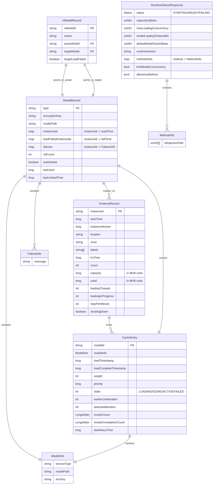
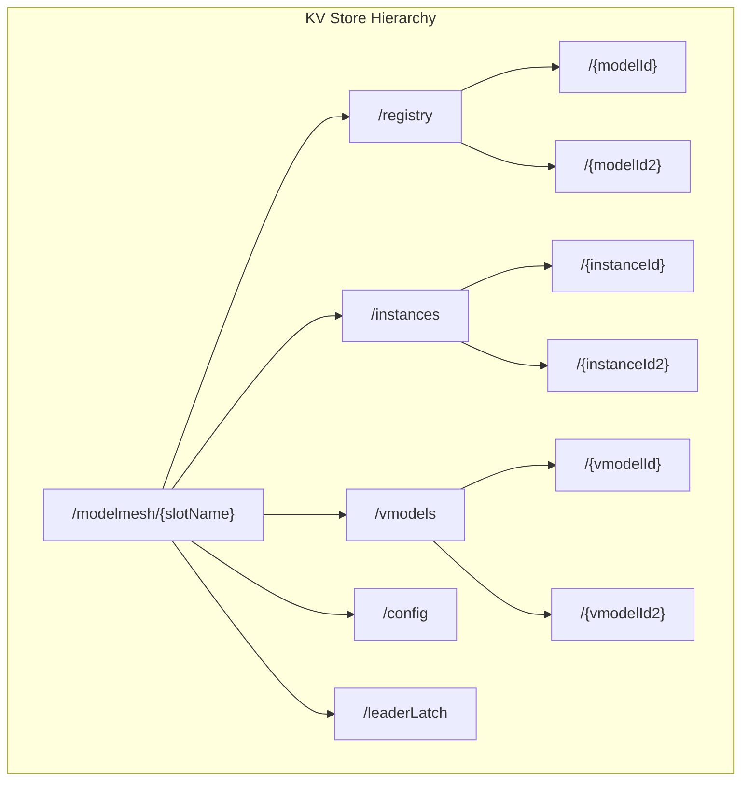
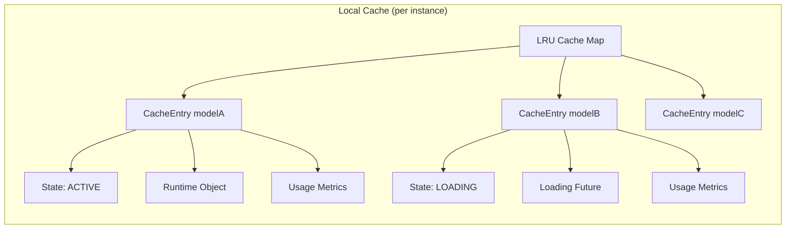
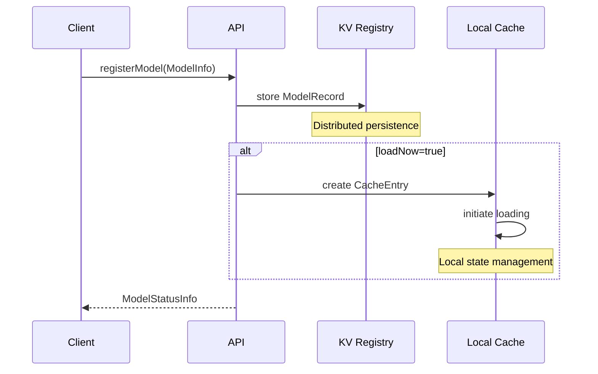
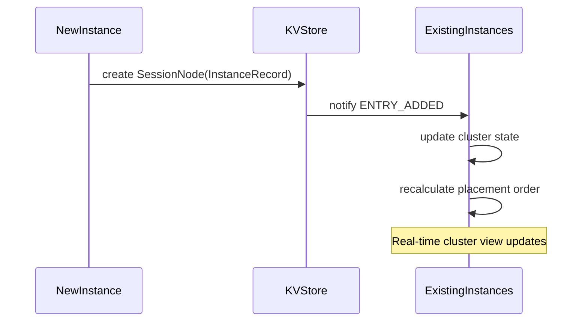
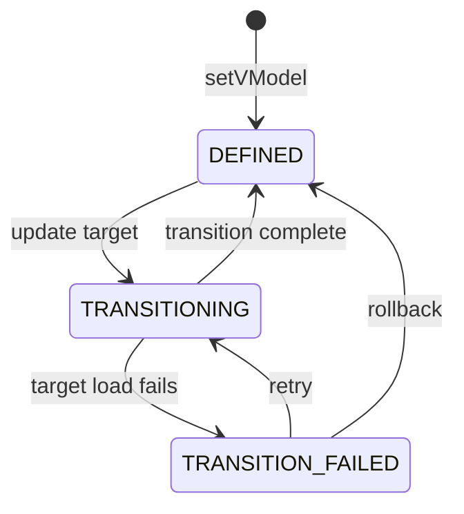

# ModelMesh Data Model Analysis

## Overview

This document provides a comprehensive analysis of the ModelMesh data model, including all core entities, their relationships, persistence mechanisms, and API representations. The data model supports distributed model management, caching, lifecycle management, and runtime integration.

## Core Data Model Diagram

### Entity Relationship Diagram



## Core Data Entities

### 1. ModelRecord - Distributed Model Registry

**Location**: `ModelRecord.java:33-281`
**Storage**: Distributed KV store (etcd/Zookeeper)
**Purpose**: Authoritative record of model metadata and cluster-wide state

```java
public final class ModelRecord extends KVRecord {
    @JsonProperty("type") private final String type;                    // Model type identifier
    @JsonProperty("encKey") private final String encryptionKey;         // Optional encryption key
    @JsonProperty("mPath") private final String modelPath;             // Model storage path
    
    // Instance tracking
    private final Map<String, Long> instanceIds;                       // instanceId -> load timestamp
    @JsonProperty("failedIn") private final Map<String, Long> loadFailedInstanceIds;
    @JsonProperty("fails") private Map<String, FailureInfo> failures;  // Failure details
    
    // Lifecycle management
    @JsonProperty("refs") private int refCount;                        // Reference counting
    @JsonProperty("autoDel") private final boolean autoDelete;         // Auto-deletion flag
    @JsonProperty("lu") private long lastUsed;                         // Cache priority
    @JsonProperty("lul") private long lastUnloadTime;                  // Scale-down logic
}
```

**Key Features**:
- **Immutable Metadata**: Type, path, and encryption key cannot be changed after creation
- **Instance Tracking**: Maintains real-time map of which instances have the model loaded
- **Failure Management**: Records load failures per instance with timestamps and messages
- **Reference Counting**: Prevents deletion while model is referenced by VModels
- **Auto-deletion**: Supports automatic cleanup when references reach zero

### 2. VModelRecord - Virtual Model Management

**Location**: `VModelRecord.java:24-95`
**Storage**: Distributed KV store (etcd/Zookeeper)
**Purpose**: Virtual model abstraction for blue/green deployments and versioning

```java
public class VModelRecord extends KVRecord {
    @JsonProperty("o") private final String owner;                     // Access control
    @JsonProperty("amid") private String activeModel;                  // Currently serving model
    @JsonProperty("tmid") private String targetModel;                  // Target for transitions
    @JsonProperty("failed") private boolean targetLoadFailed;          // Transition failure flag
}
```

**Key Features**:
- **Ownership**: Immutable owner field for multi-tenant access control
- **State Transitions**: Supports gradual migration from active to target model
- **Failure Handling**: Tracks target model load failures for rollback decisions
- **Zero-Downtime Updates**: Enables seamless model version transitions

### 3. InstanceRecord - Cluster Member State

**Location**: `InstanceRecord.java:33-256`
**Storage**: Distributed KV store (etcd/Zookeeper) via SessionNode
**Purpose**: Real-time cluster member capacity and health information

```java
public class InstanceRecord extends KVRecord {
    // Identity
    @JsonProperty("startTime") private final long startTime;
    @JsonProperty("vers") private final long instanceVersion;
    @JsonProperty("loc") private final String location;               // Node/location
    @JsonProperty("zone") private final String zone;                  // Availability zone
    @JsonProperty("labels") private final String[] labels;            // Type constraints
    
    // Capacity metrics (in 8KiB units)
    @JsonProperty("cap") private long capacity;                       // Total capacity
    @JsonProperty("used") private long used;                          // Used capacity
    @JsonProperty("lruTime") private long lruTime;                    // Oldest model time
    @JsonProperty("count") private int count;                         // Model count
    
    // Load management
    @JsonProperty("lThreads") private int loadingThreads;             // Loading concurrency
    @JsonProperty("lInProg") private int loadingInProgress;           // Active loads
    @JsonProperty("rpm") private int reqsPerMinute;                   // Request rate
    @JsonProperty("shutdown") private boolean shuttingDown;           // Termination flag
}
```

**Key Features**:
- **Ephemeral Registration**: Automatically cleaned up when instance disconnects
- **Real-time Metrics**: Continuously updated capacity, load, and health information
- **Placement Optimization**: Provides data for intelligent model placement decisions
- **Type Constraints**: Supports heterogeneous clusters with label-based restrictions

### 4. CacheEntry - Local Model Cache State

**Location**: `ModelMesh.java:1632-2600` (approx.)
**Storage**: Local memory (ConcurrentLinkedHashMap)
**Purpose**: Per-instance model cache management and loading coordination

```java
class CacheEntry<T> extends AbstractFuture<T> implements Runnable, Comparable<CacheEntry<?>> {
    // Identity
    protected final String modelId;
    private final ModelInfo modelInfo;
    final long loadTimestamp;
    long loadCompleteTimestamp;
    
    // State management
    volatile int state;                                               // LOADING/SIZING/ACTIVE/FAILED
    volatile int weight;                                              // Memory weight
    long priority;                                                    // Load priority
    
    // Usage tracking
    int earlierUseIteration, lastUsedIteration;                      // Rate tracking
    private final LongAdder invokeCount;                             // Request counter
    private final LongAdder invokeCompletionCount;                   // Completion counter
    private volatile long lastHeavyTime;                             // Load threshold time
}
```

**State Transitions**:
```
INSERTION → LOADING → SIZING → ACTIVE
         ↘         ↘       ↘    ↓
           FAILED ← FAILED ← FAILED
```

**Key Features**:
- **Asynchronous Loading**: Future-based loading with state tracking
- **Memory Management**: Precise weight tracking for LRU eviction
- **Usage Analytics**: Request counting and rate tracking for scaling decisions
- **Failure Handling**: Comprehensive error state management and recovery

### 5. ModelInfo - Model Metadata

**Location**: `ModelInfo.java` (Thrift), protobuf definitions
**Storage**: Embedded within ModelRecord and CacheEntry
**Purpose**: Essential model loading information

```java
// Thrift version
public class ModelInfo implements TBase<ModelInfo, ModelInfo._Fields> {
    public String serviceType;                                        // Model type/runtime
    public String modelPath;                                          // Storage location
    public String encKey;                                             // Optional encryption
}

// Protobuf version (API)
message ModelInfo {
    string type = 1;                                                  // Model type
    string path = 2;                                                  // Model path  
    string key = 3;                                                   // Encryption key
}
```

**Key Features**:
- **Runtime Binding**: Type field determines which runtime handles the model
- **Location Independence**: Path abstraction supports various storage backends
- **Security**: Optional encryption key for model data protection

## Runtime Integration Data Model

### 6. Runtime API Messages

**Location**: `model-runtime.proto:67-176`
**Purpose**: Communication between ModelMesh and model runtime containers

#### Load Model Request/Response
```protobuf
message LoadModelRequest {
    string modelId = 1;
    string modelType = 2;
    string modelPath = 3;
    string modelKey = 4;
}

message LoadModelResponse {
    uint64 sizeInBytes = 1;                                          // Actual memory usage
    uint32 maxConcurrency = 2;                                       // Concurrency limit
}
```

#### Runtime Status
```protobuf
message RuntimeStatusResponse {
    enum Status { STARTING = 0; READY = 1; FAILING = 2; }
    Status status = 1;
    uint64 capacityInBytes = 2;                                      // Total memory capacity
    uint32 maxLoadingConcurrency = 3;                               // Parallel load limit
    uint32 modelLoadingTimeoutMs = 4;                               // Load timeout
    uint64 defaultModelSizeInBytes = 5;                             // Size estimate
    string runtimeVersion = 6;                                       // Runtime version
    map<string, MethodInfo> methodInfos = 8;                        // Method routing info
    bool limitModelConcurrency = 9;                                 // Enable concurrency control
    bool allowAnyMethod = 10;                                       // Method filtering
}

message MethodInfo {
    repeated uint32 idInjectionPath = 1;                            // Model ID injection path
}
```

## Data Persistence and Storage

### Distributed Storage (etcd/Zookeeper)



**Storage Characteristics**:
- **Consistency**: Strong consistency via distributed consensus
- **Durability**: Persistent storage with replication
- **Session Management**: Ephemeral nodes for instance lifecycle
- **Change Notifications**: Real-time event propagation to all cluster members

### Local Cache Storage



**Cache Characteristics**:
- **LRU Eviction**: Automatic eviction based on usage patterns
- **Weight-based**: Memory-aware eviction using model sizes
- **Concurrent**: Thread-safe operations with atomic updates
- **Metrics Integration**: Built-in usage tracking and analytics

## Data Flow Patterns

### Model Registration Flow



### Instance Addition Flow



### VModel Transition Flow



## Data Consistency Mechanisms

### 1. Distributed Consistency

**ModelRecord Updates**:
- **Conditional Updates**: Compare-and-swap operations prevent lost updates
- **Version Vectors**: KVRecord base class provides optimistic concurrency control
- **Atomic Operations**: Instance list updates are atomic at the record level

**Instance Registration**:
- **Session-based**: Ephemeral nodes ensure automatic cleanup
- **Leader Coordination**: Single leader handles cluster-wide housekeeping
- **Event Ordering**: Sequential event processing maintains consistency

### 2. Local Consistency

**Cache Operations**:
- **Single Writer**: Only the owning instance modifies its cache entries
- **Atomic State Transitions**: CacheEntry state changes are atomic
- **Memory Barriers**: Volatile fields ensure visibility across threads

**Registry Synchronization**:
- **Background Updates**: Periodic sync between cache and registry
- **Conflict Resolution**: Cache state takes precedence over stale registry data
- **Failure Recovery**: Failed loads automatically update failure maps

## Data Model Evolution and Versioning

### 1. Backward Compatibility

**JSON Serialization**:
- **Optional Fields**: New fields added as optional with defaults
- **Field Aliasing**: `@JsonProperty` annotations maintain compatibility
- **Graceful Degradation**: Unknown fields ignored during deserialization

**Schema Evolution**:
```java
// Example: Adding new field with backward compatibility
@JsonProperty("newField")
private String newFeature = DEFAULT_VALUE;  // Default prevents breaking changes
```

### 2. Migration Strategies

**Model Registry Migration**:
- **Rolling Updates**: Gradual deployment with version compatibility
- **Default Values**: Missing fields populated with sensible defaults
- **Feature Flags**: New functionality gated by configuration

**Instance Record Evolution**:
- **Additive Changes**: New metrics added without breaking existing logic
- **Deprecated Fields**: Old fields maintained for transition periods
- **Version Detection**: Instance version field enables compatibility logic

## Performance Characteristics

### 1. Storage Performance

**Distributed Storage**:
- **Read Optimization**: Local caching reduces KV store load
- **Write Batching**: Conditional updates minimize network overhead
- **Index Usage**: Efficient key-based lookups
- **Compression**: JSON serialization with optional compression

**Local Cache**:
- **O(1) Access**: HashMap-based lookup for cache entries
- **LRU Efficiency**: Constant-time eviction decisions
- **Memory Pooling**: Reused objects reduce GC pressure
- **Lock-free Operations**: Atomic operations where possible

### 2. Scalability Patterns

**Horizontal Scaling**:
- **Sharded Storage**: Model registry naturally sharded by model ID
- **Distributed Caching**: Each instance maintains independent cache
- **Event Fanout**: Instance changes broadcast to all members
- **Load Distribution**: Placement algorithms distribute load evenly

**Vertical Scaling**:
- **Memory Management**: Precise tracking enables maximum utilization
- **Concurrent Loading**: Parallel model loading within resource limits
- **Batch Operations**: Registry updates batched when possible
- **Connection Pooling**: Efficient KV store connection management

## Data Security and Access Control

### 1. Encryption and Privacy

**Model Data Protection**:
- **Encryption Keys**: Optional per-model encryption support
- **Transport Security**: TLS for all KV store communications
- **At-Rest Encryption**: Delegated to underlying storage system
- **Key Management**: External key management system integration

**Access Control**:
- **VModel Ownership**: String-based ownership for multi-tenancy
- **Instance Isolation**: Each instance manages its own resources
- **Network Segmentation**: Optional network-level access control
- **Audit Logging**: Operation logging for compliance

### 2. Data Validation

**Input Validation**:
- **Model ID Constraints**: Non-empty, valid identifier format
- **Path Validation**: Secure path handling to prevent directory traversal
- **Type Checking**: Runtime type validation for model types
- **Size Limits**: Maximum sizes for metadata fields

**Consistency Validation**:
- **Reference Integrity**: VModel references validated against model registry
- **State Validation**: Cache entry states validated during transitions
- **Capacity Validation**: Instance capacity validated against actual usage
- **Version Consistency**: API version compatibility checking

## Summary

The ModelMesh data model provides a sophisticated foundation for distributed model management with:

### **Core Strengths**:
1. **Distributed Consistency**: Strong consistency for critical metadata via KV store
2. **Local Performance**: High-performance local caching with LRU eviction
3. **Flexible Abstractions**: VModels enable zero-downtime updates and versioning
4. **Real-time Coordination**: Instance records enable dynamic cluster membership
5. **Failure Resilience**: Comprehensive error tracking and recovery mechanisms
6. **Security Integration**: Encryption and access control capabilities

### **Architectural Benefits**:
1. **Separation of Concerns**: Clear distinction between global state and local cache
2. **Event-Driven Architecture**: Real-time notifications enable responsive coordination
3. **Schema Evolution**: Backward-compatible changes support rolling updates
4. **Performance Optimization**: Multiple levels of caching and batching
5. **Operational Visibility**: Rich metadata supports monitoring and debugging

The data model successfully balances consistency, performance, and operational requirements while providing the flexibility needed for complex model lifecycle management in distributed environments.