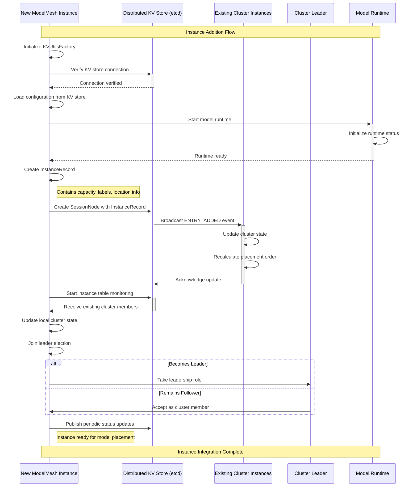
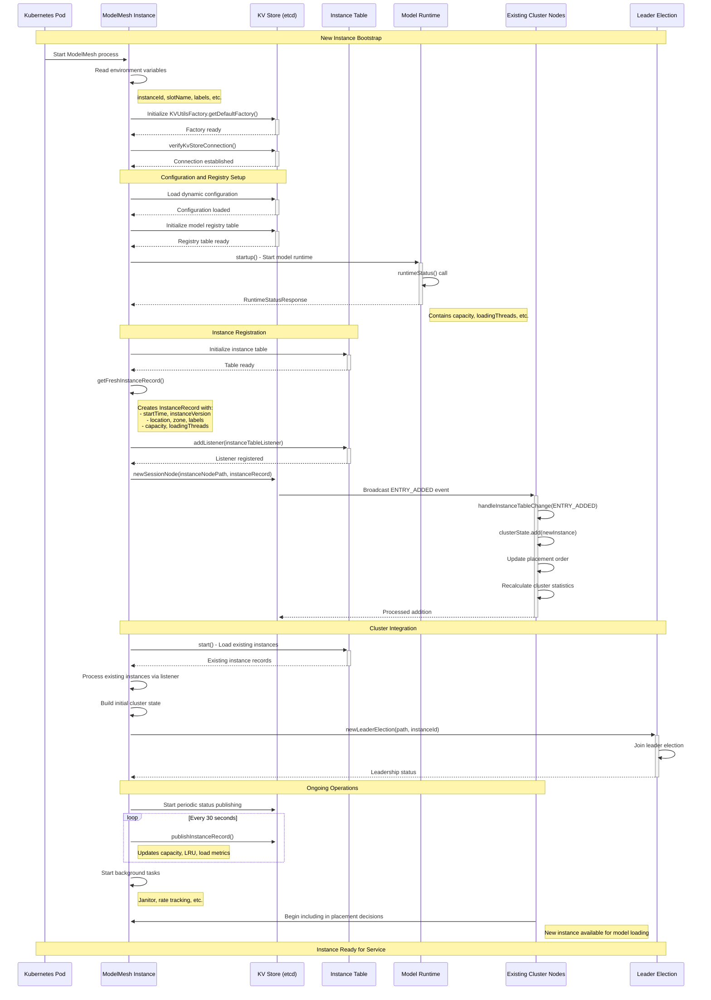

# ModelMesh Instance Addition to Cluster Analysis

## Overview

This document analyzes the process of adding a new ModelMesh instance to an existing cluster, covering the initialization sequence, cluster discovery, registration, and integration mechanisms that enable dynamic scaling of the ModelMesh deployment.

## Instance Addition Flow Sequence Diagram

### Simplified View - New Instance Joining Cluster



### Detailed View - Complete Initialization Sequence



## Detailed Analysis

### 1. Pre-Initialization Phase

**Environment Setup**
- **Instance ID Generation**: Typically derived from Kubernetes pod name
- **Configuration Reading**: Environment variables for labels, capacity, etc.
- **KV Store Connection**: Establishes connection to etcd/Zookeeper

**Key Environment Variables**:
```java
// From ModelMeshEnvVars
MM_SERVICE_NAME_ENV_VAR           // Service name for cluster membership
MM_INSTANCE_ID_ENV_VAR            // Unique instance identifier  
MM_LABELS_ENV_VAR                 // Type constraint labels
MM_LOCATION_ENV_VAR               // Physical location/zone
MM_DEFAULT_BUCKET_SIZE_ENV_VAR    // Memory capacity configuration
```

### 2. KV Store Integration

**Location**: `ModelMesh.java:496-501, 583-788`

**Connection Establishment**:
```java
kvUtilsFactory = KVUtilsFactory.getDefaultFactory();
kvStoreVerifyFuture = kvUtilsFactory.verifyKvStoreConnection();
```

**Path Structure**:
- **Instance Table**: `/{KV_STORE_PREFIX}/{slotName}/instances`
- **Instance Node**: `/{KV_STORE_PREFIX}/{slotName}/instances/{instanceId}`
- **Registry**: `/{KV_STORE_PREFIX}/{slotName}/registry`

### 3. Runtime Integration

**Location**: `ModelMesh.java:671-673`

**Runtime Startup**:
- Calls abstract `startup()` method implemented by subclasses
- Receives `LocalInstanceParameters` with capacity information
- Initializes model loading infrastructure

**Runtime Status Check**:
```java
RuntimeStatusResponse status = runtime.runtimeStatus();
// Extracts: capacityInBytes, maxLoadingConcurrency, defaultModelSizeInBytes
```

### 4. Instance Record Creation

**Location**: `ModelMesh.java:5369-5388`

**InstanceRecord Structure**:
```java
public class InstanceRecord extends KVRecord {
    @JsonProperty("startTime") private final long startTime;
    @JsonProperty("vers") private final long instanceVersion; 
    @JsonProperty("loc") private final String location;
    @JsonProperty("zone") private final String zone;
    @JsonProperty("labels") private final String[] labels;
    @JsonProperty("cap") private long capacity;          // In 8KiB units
    @JsonProperty("used") private long used;             // In 8KiB units  
    @JsonProperty("lThreads") private int loadingThreads;
    @JsonProperty("rpm") private int reqsPerMinute;
    // ... additional fields
}
```

**Fresh Record Generation**:
```java
protected InstanceRecord getFreshInstanceRecord() {
    long oldest = runtimeCache.oldestTime();
    long cap = runtimeCache.capacity(), used = runtimeCache.weightedSize();
    int count = runtimeCache.size();
    // Create record with current state
}
```

### 5. Cluster Discovery and Registration

**Location**: `ModelMesh.java:783-794`

**Instance Table Setup**:
```java
instanceTable = kvUtilsFactory.newKVTable(instanceTablePath, 0);
instanceInfo = instanceTable.getView(INST_REC_SERIALIZER, 1);
instanceInfo.addListener(false, instanceTableListener());
```

**Session Node Creation**:
```java
byte[] initData = INST_REC_SERIALIZER.serialize(getFreshInstanceRecord());
myNode = kvUtilsFactory.newSessionNode(instanceNodePath, initData);
```

### 6. Cluster State Integration

**Location**: `ModelMesh.java:1455-1559`

**Instance Table Listener**:
```java
private void handleInstanceTableChange(EventType type, String key, InstanceRecord record) {
    switch (type) {
        case ENTRY_ADDED:
        case ENTRY_UPDATED:
            // Add to type constraints if applicable
            if (typeConstraints != null) {
                subsetStats = typeConstraints.instanceAdded(key, record.getLabels(), false);
            }
            // Add to cluster state with placement ordering
            boolean added = clusterState.add(Maps.immutableEntry(key, record));
            // Update cluster statistics
            clusterStatsTracker.add(key, record);
            break;
        case ENTRY_DELETED:
            // Remove from cluster state and stats
            break;
    }
}
```

**Placement Order Integration**:
- New instance added to `clusterState` (sorted by `PLACEMENT_ORDER`)
- Placement order considers capacity, load, and constraints
- Instance becomes available for model placement decisions

### 7. Leader Election Participation

**Location**: `ModelMesh.java:822-825`

**Leader Election Setup**:
```java
String llatchPath = ZKPaths.makePath(KV_STORE_PREFIX, slotName, "leaderLatch");
leaderLatch = kvUtilsFactory.newLeaderElection(llatchPath, leaderLatchId);
leaderLatch.addListener(this::leaderChange);
leaderLatch.start();
```

**Leadership Responsibilities**:
- **Model Registry Cleanup**: Pruning stale model records
- **Missing Instance Detection**: Tracking unavailable instances  
- **Cluster Housekeeping**: Various maintenance tasks

### 8. Periodic Status Publishing

**Location**: `ModelMesh.java:1152-1162, 5391-5533`

**Publishing Schedule**:
```java
// Every 30 seconds (INSTANCE_REC_PUBLISH_FREQ_MS)
taskPool.scheduleWithFixedDelay(() -> {
    publishInstanceRecord(false, false);
}, INSTANCE_REC_PUBLISH_FREQ_MS, INSTANCE_REC_PUBLISH_FREQ_MS, MILLISECONDS);
```

**Status Updates Include**:
- **Capacity Metrics**: Used/available memory
- **Cache State**: LRU timestamp, model count
- **Load Metrics**: Requests per minute, loading threads
- **Health Status**: Shutting down flag

### 9. Type Constraints Integration

**Location**: `TypeConstraintManager.java`, `ModelMesh.java:777, 1488-1494`

**Constraint Processing**:
- If type constraints are configured, instance labels are processed
- Instance is assigned to appropriate constraint subset
- Placement decisions respect label-based constraints
- Instance becomes available only for compatible model types

## Key Components and Interactions

### Instance Table Structure

**Technology**: Distributed KV table with session-based membership
**Persistence**: Ephemeral session nodes (deleted when instance disconnects)
**Monitoring**: Real-time change notifications to all cluster members

### Cluster State Management

**Data Structure**: `ConcurrentSkipListSet<Entry<String, InstanceRecord>>`
**Ordering**: `PLACEMENT_ORDER` comparator for optimal placement
**Thread Safety**: Concurrent updates from multiple instance table events

### Session Management

**Session Nodes**: Ephemeral entries tied to instance lifecycle
**Lease Management**: Automatic cleanup when instance disconnects
**Reconnection Handling**: Automatic re-registration on session expiry

## Instance Addition Scenarios

### Scenario 1: Clean Cluster Join
```
New instance starts → Connects to KV store → Registers in instance table
→ Existing instances discover new member → Placement algorithms include new instance
→ New instance ready for model assignments
```

### Scenario 2: Instance Replacement (Rolling Update)
```
Old instance marks shutdown → New instance starts → 
Registers with same or different instanceId → 
Models migrate from old to new instance → Old instance terminates
```

### Scenario 3: Scale-Out Addition
```
Cluster under load → New instance added → 
Joins with available capacity → 
Load balancer begins routing new models → Cluster capacity increased
```

### Scenario 4: Instance with Type Constraints
```
New instance with specific labels → 
Type constraint manager processes labels → 
Instance becomes available only for compatible model types →
Placement decisions respect constraints
```

## Error Handling and Recovery

### Connection Failures
- **KV Store Unavailable**: Startup fails with clear error message
- **Session Expiry**: Automatic re-registration via `publishInstanceRecordAsync()`
- **Network Partitions**: Session-based cleanup removes disconnected instances

### Configuration Issues
- **Invalid Labels**: Warning logged, instance joins without constraints
- **Disabled Slot**: Startup prevented with configuration error
- **Version Incompatibility**: Detected by upgrade tracker

### Resource Constraints
- **Insufficient Memory**: Instance reports limited capacity
- **Runtime Startup Failure**: Prevents instance from joining cluster
- **Invalid Runtime Configuration**: Caught during initialization

## Performance and Scalability Considerations

### Cluster Discovery Performance
- **Parallel Initialization**: Registry and instance table loading overlap
- **Efficient Change Propagation**: Delta-based cluster state updates
- **Lazy Loading**: Models loaded on-demand, not during instance join

### Memory Management
- **Capacity Reporting**: Real-time tracking of available memory
- **Dynamic Adjustment**: Capacity updates based on actual usage
- **Unload Buffer**: Reserved capacity for graceful model eviction

### Network Efficiency
- **Batch Updates**: Instance status published at fixed intervals
- **Change Detection**: Only publishes when metrics change significantly
- **Compression**: Efficient serialization of instance records

## Configuration Parameters

### Instance Configuration
```bash
MM_SERVICE_NAME          # Cluster service name
MM_INSTANCE_ID           # Unique instance identifier  
MM_LABELS               # Type constraint labels (comma-separated)
MM_LOCATION             # Physical location/node name
MM_ZONE                 # Availability zone
MM_DEFAULT_BUCKET_SIZE  # Memory capacity in MiB
```

### Timing Parameters
```java
INSTANCE_REC_PUBLISH_FREQ_MS = 30000     // Status publishing interval
BOOTSTRAP_CLEARANCE_PERIOD_MS = 180000   // Startup protection period  
```

### KV Store Paths
```
/{KV_STORE_PREFIX}/{slotName}/instances/{instanceId}  // Instance registration
/{KV_STORE_PREFIX}/{slotName}/leaderLatch              // Leader election
/{KV_STORE_PREFIX}/{slotName}/config                   // Dynamic configuration
```

## Integration with Kubernetes

### Pod Lifecycle Integration
- **Pod Name → Instance ID**: Automatic derivation from Kubernetes metadata
- **Resource Limits → Capacity**: Memory limits translate to model capacity
- **Node Affinity → Location**: Kubernetes node information used for placement

### Service Discovery
- **Cluster DNS**: Litelinks service discovery for inter-instance communication
- **Load Balancing**: External load balancer routes to available instances
- **Health Checks**: Readiness probes ensure instance is ready for traffic

### Rolling Updates
- **Graceful Shutdown**: Instance marks itself as shutting down
- **Model Migration**: Models automatically migrate to new instances  
- **Zero Downtime**: New instances ready before old instances terminate

## Summary

The ModelMesh instance addition process implements a robust, distributed membership system with the following characteristics:

- **Dynamic Discovery**: Automatic detection and integration of new instances
- **Session-Based Membership**: Ephemeral registration with automatic cleanup
- **Constraint-Aware Placement**: Support for heterogeneous clusters with type constraints
- **Leader Election**: Distributed coordination for cluster management tasks
- **Real-Time Updates**: Continuous capacity and health monitoring
- **Graceful Integration**: New instances seamlessly join without disrupting existing operations

The system successfully enables horizontal scaling of ModelMesh deployments while maintaining consistency, performance, and fault tolerance across the distributed cluster.