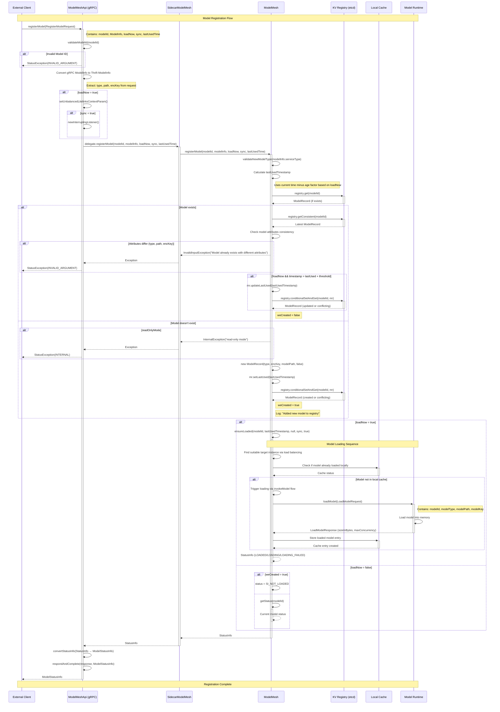

# ModelMesh Model Registration Flow Analysis

## Overview

This document analyzes the model registration flow in ModelMesh, tracing the complete sequence from external client request through internal processing to model registry storage and optional loading.

## Registration Flow Sequence Diagram



## Detailed Flow Analysis

### 1. Request Validation Phase

**Location**: `ModelMeshApi.java:357-361`

- **Input Validation**: Checks for non-empty `modelId`
- **Parameter Conversion**: Converts gRPC `ModelInfo` to Thrift `ModelInfo`
- **Context Setup**: Sets load balancing context parameters if `loadNow=true`

### 2. Model Information Processing

**Location**: `ModelMesh.java:3088-3096`

- **Type Validation**: Validates model type against runtime capabilities
- **Timestamp Calculation**: Computes `lastUsedTimestamp` based on:
  - Current time if not specified
  - 6x older for non-immediate loads (cache deprioritization)
  - Respects provided `initialCacheTimestamp`

### 3. Registry Operations

**Location**: `ModelMesh.java:3104-3147`

#### Existing Model Path:
- **Consistency Check**: Retrieves latest version from distributed registry
- **Attribute Validation**: Ensures type, path, and encryption key match
- **Timestamp Update**: Updates last used time if conditions met
- **Conflict Resolution**: Handles concurrent modifications via conditional updates

#### New Model Path:
- **Read-Only Check**: Rejects registration in read-only mode
- **Record Creation**: Creates new `ModelRecord` with metadata
- **Registry Storage**: Atomic conditional storage to prevent duplicates
- **Logging**: Records successful model addition

### 4. Optional Loading Phase

**Location**: `ModelMesh.java:3154-3164`

#### When `loadNow=true`:
- **Load Triggering**: Calls `ensureLoaded` to initiate model loading
- **Instance Selection**: Uses placement algorithms to choose target instance
- **Runtime Integration**: Communicates with model runtime via gRPC
- **Cache Management**: Updates local cache with loaded model

#### When `loadNow=false`:
- **Status Determination**: Returns `NOT_LOADED` for new models
- **Existing Status**: Queries current status for existing models

### 5. Response Construction

**Location**: `ModelMeshApi.java:380-386`

- **Status Conversion**: Converts internal `StatusInfo` to gRPC `ModelStatusInfo`
- **Error Handling**: Maps exceptions to appropriate gRPC status codes
- **Response Delivery**: Sends response to client and completes stream

## Key Components and Interactions

### ModelRecord Structure

**Location**: `ModelRecord.java:33-80`

```java
public final class ModelRecord extends KVRecord {
    @JsonProperty("type") private final String type;
    @JsonProperty("encKey") private final String encryptionKey;
    @JsonProperty("mPath") private final String modelPath;
    private final Map<String, Long> instanceIds;        // instanceId -> loaded time
    private final Map<String, Long> loadFailedInstanceIds;  // instanceId -> failed time
    private Map<String, FailureInfo> failures;         // instanceId -> failure details
}
```

**Key Features**:
- **Immutable Metadata**: Type, path, and encryption key cannot be changed
- **Instance Tracking**: Tracks which instances have the model loaded
- **Failure Management**: Records load failures per instance with timestamps
- **Version Control**: Supports conditional updates for consistency

### Registry Interface

**Technology**: Distributed key-value store (etcd/Zookeeper)

**Operations**:
- `registry.get(modelId)` - Retrieve model record
- `registry.getConsistent(modelId)` - Get latest consistent version
- `registry.conditionalSetAndGet(modelId, record)` - Atomic compare-and-swap

### Cache Integration

**Local Cache**: ConcurrentLinkedHashMap with LRU eviction
**Integration**: Models loaded on-demand during registration if `loadNow=true`

## Registration Scenarios

### Scenario 1: New Model Registration (loadNow=false)
```
Client → registerModel(id="model1", info={type:"sklearn"}, loadNow=false)
Result: Model registered in etcd, status=NOT_LOADED
```

### Scenario 2: New Model with Immediate Load (loadNow=true, sync=false)
```
Client → registerModel(id="model2", info={type:"pytorch"}, loadNow=true, sync=false)
Result: Model registered + load initiated, status=LOADING
```

### Scenario 3: New Model with Synchronous Load (loadNow=true, sync=true)
```
Client → registerModel(id="model3", info={type:"tensorflow"}, loadNow=true, sync=true)
Result: Model registered + loaded completely, status=LOADED
```

### Scenario 4: Duplicate Registration (Same Attributes)
```
Client → registerModel(id="existing", info={same attributes})
Result: Success, updates lastUsed timestamp, returns current status
```

### Scenario 5: Conflicting Registration (Different Attributes)
```
Client → registerModel(id="existing", info={different type/path})
Result: InvalidInputException - "Model already exists with different attributes"
```

## Error Handling

### Validation Errors
- **Empty Model ID**: `INVALID_ARGUMENT` - "must provide non-empty modelId"
- **Invalid Type**: `INVALID_ARGUMENT` - Type not supported by runtime
- **Attribute Conflict**: `INVALID_ARGUMENT` - "Model already exists with different attributes"

### System Errors
- **Read-Only Mode**: `INTERNAL` - "model-mesh read-only mode"
- **Registry Failure**: `INTERNAL` - "Failed to add model {modelId}"
- **Load Failure**: Status reflects loading state (LOADING_FAILED)

### Concurrency Handling
- **Conditional Updates**: Prevents lost updates through compare-and-swap
- **Retry Logic**: Handles concurrent modifications by retrying operations
- **Consistency Checks**: Ensures latest version retrieved before modifications

## Performance Considerations

### Optimizations
1. **Lazy Loading**: Models not loaded until first inference request (unless `loadNow=true`)
2. **Conditional Registry Updates**: Only updates registry when necessary
3. **Local Caching**: Avoids repeated registry lookups for existing models
4. **Timestamp Management**: Optimizes cache priorities through strategic aging

### Scalability Features
1. **Distributed Registry**: Supports cluster-wide model visibility
2. **Atomic Operations**: Prevents race conditions in distributed environment
3. **Idempotent API**: Safe to retry registration operations
4. **Load Balancing**: Distributes model placement across cluster instances

## Summary

The ModelMesh registration flow implements a robust, distributed model management system with the following key characteristics:

- **Atomic Registration**: Ensures consistent model metadata across the cluster
- **Flexible Loading**: Supports both immediate and deferred model loading
- **Conflict Prevention**: Validates attribute consistency for existing models
- **Distributed Coordination**: Uses etcd/Zookeeper for cluster-wide state management
- **Performance Optimization**: Minimizes unnecessary operations through intelligent caching and lazy loading

The flow successfully balances consistency, performance, and usability while providing comprehensive error handling and conflict resolution mechanisms.